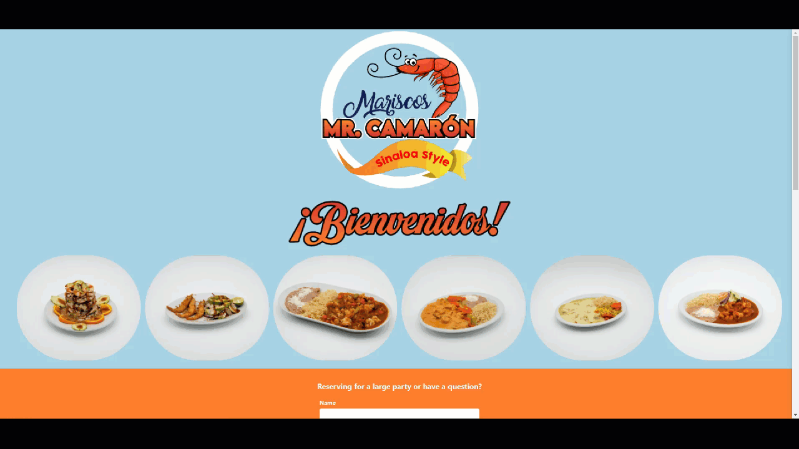

# Restaurant Mr.Camaron

<a href="" target="_blank">See it live!</a>

## Table of Contents

- [Restaurant Mr.Camaron](#restaurant-mrcamaron)
  - [Table of Contents](#table-of-contents)
  - [Project Information](#project-information)
  - [Languages, Frameworks, and Technology](#languages-frameworks-and-technology)
  - [Features](#features)

## Project Information

- Mexican seafood restaurant site, built using MERN & Tailwindcss
- Domain joined, and hosted on Google Cloud.

## Languages, Frameworks, and Technology

- [JavaScript](https://devdocs.io/javascript/)
- [React](https://beta.reactjs.org/)
- [CSS3](https://devdocs.io/css/)
- [HTML5](https://devdocs.io/html/)
- [Tailwindcss](https://tailwindcss.com/)
- [Vite](https://vitejs.dev/)
- [NodeJS](https://nodejs.org/en/docs/)
- [NPM](https://docs.npmjs.com/)
- [Git](https://devdocs.io/git/)
- [Dotenv](https://www.npmjs.com/package/dotenv)
- [Cross-env](https://www.npmjs.com/package/cross-env)
- [Nodemailer](https://nodemailer.com/about/)
- [SwiperJs](https://swiperjs.com/)
- [Static google maps](https://developers.google.com/maps/documentation/maps-static/overview)
- [MongoDB Atlas](https://www.mongodb.com/atlas/database)
- [Google Cloud](https://cloud.google.com/)

## Features

- User message submissions are emailed to the restaurant social account.
- Food images pulled from Google Cloud CDN
- Swiper api creates an infinitely looping carousel with the provided food images.
- Static google maps api generates an image derived from the restaurants coordinates.
- Hosted on Google Cloud App Engine
